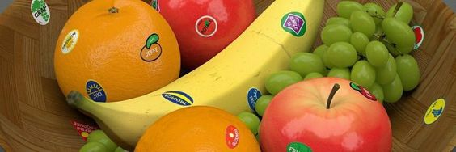

  

# Fruits Classification 🍓🍉🍒🍑

This repository contains a Jupyter Notebook for classifying different types of fruits based on various attributes. The notebook utilizes the popular Python libraries `pandas` and `matplotlib` to analyze and visualize fruit data.

## Overview

The dataset used in this project includes information about different fruits, such as:

- `fruit_label`: Numeric label for the fruit
- `fruit_name`: Name of the fruit
- `fruit_subtype`: Subtype of the fruit
- `mass`: Mass of the fruit in grams
- `width`: Width of the fruit in cm
- `height`: Height of the fruit in cm
- `color_score`: A score representing the color of the fruit

### Sample Data

The initial rows of the dataset are as follows:

| fruit_label | fruit_name | fruit_subtype | mass | width | height | color_score |
|-------------|------------|---------------|------|-------|--------|-------------|
| 1           | apple      | granny_smith  | 192  | 8.4   | 7.3    | 0.55        |
| 1           | apple      | granny_smith  | 180  | 8.0   | 6.8    | 0.59        |
| 1           | apple      | granny_smith  | 176  | 7.4   | 7.2    | 0.60        |
| 2           | mandarin   | mandarin      | 86   | 6.2   | 4.7    | 0.80        |
| 2           | mandarin   | mandarin      | 84   | 6.0   | 4.6    | 0.79        |
